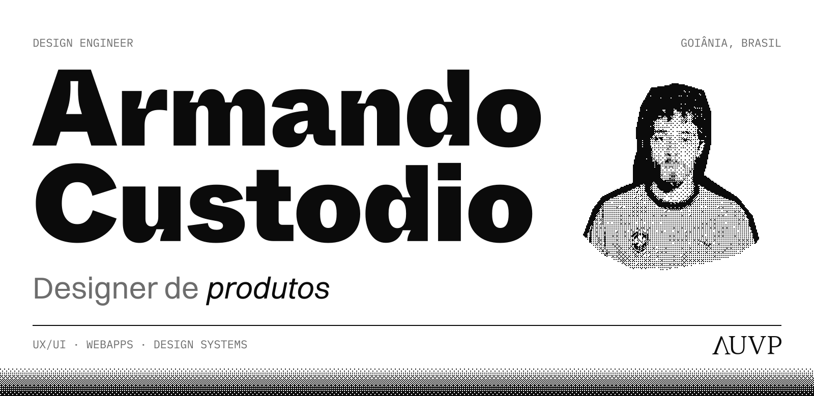
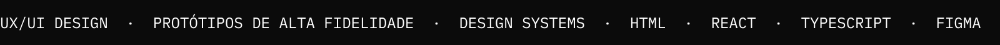

<a href="https://auvp.com.br/">
  <picture>
    <source media="(prefers-color-scheme: dark)" srcset="assets/header-dark.svg">
    
  </picture>
</a>
<picture>
  <source media="(prefers-color-scheme: dark)" srcset="assets/marquee-dark.svg">
  
</picture>

Curioso em tempo integral, sou um pouco de tudo: apaixonado por música, ilustrador, entusiasta de tecnologia, nerd de assuntos aleatórios, e já há uma década transformei minha vontade de criar em profissão.
